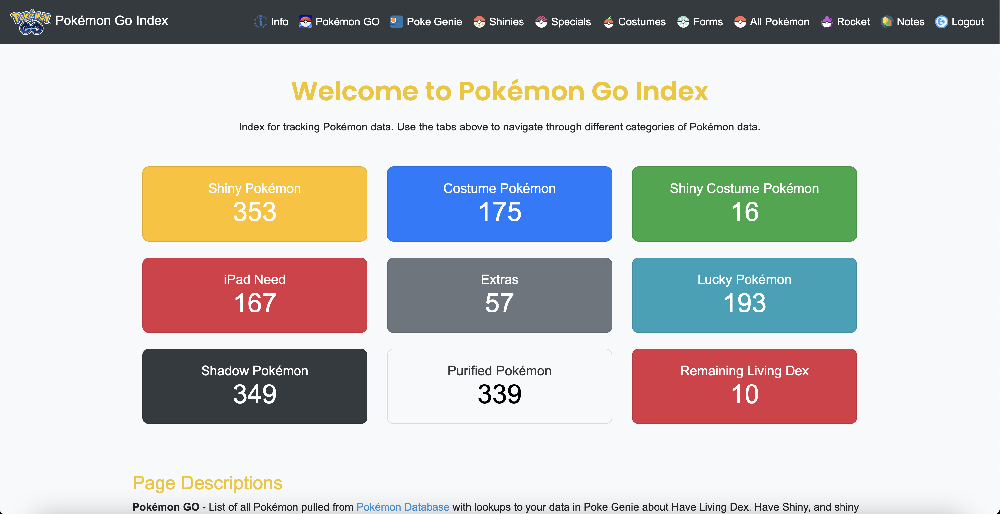
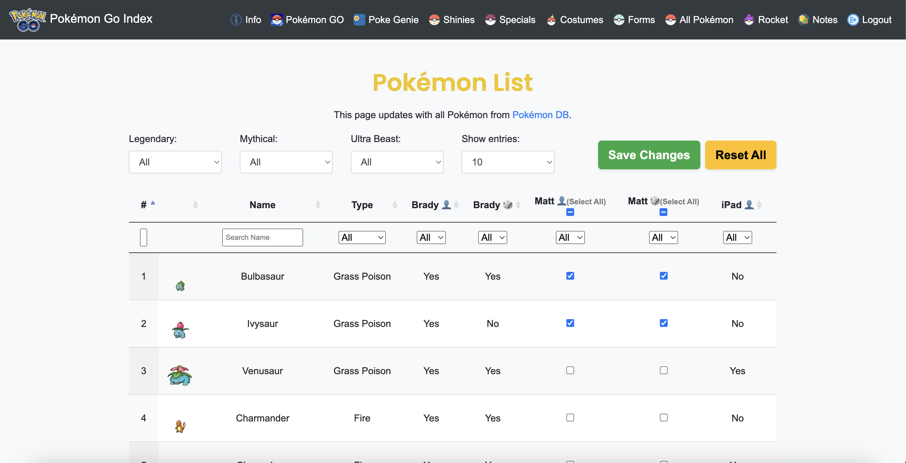

# Pokémon Go Dex Tracker

An advanced web application for tracking Pokémon ownership, utilizing data scraping, API integration, and dynamic data tables to provide a comprehensive and interactive experience for Pokémon Go enthusiasts.

## Table of Contents

- [Introduction](#introduction)
- [Features](#features)
- [Technologies Used](#technologies-used)
- [Setup and Installation](#setup-and-installation)
- [Usage](#usage)
- [Screenshots](#screenshots)
- [Future Enhancements](#future-enhancements)
- [Contributing](#contributing)
- [License](#license)
- [Acknowledgments](#acknowledgments)

---

## Introduction

The **Pokémon Go Dex Tracker** is a web application designed to help Pokémon Go players track their Pokémon collection across multiple accounts. By leveraging web scraping, API integration, and extensive data manipulation, the application provides real-time updates and a user-friendly interface for managing and visualizing Pokémon ownership.

This project demonstrates advanced functionalities such as:

- Data retrieval from external sources (Wikipedia, Poke Genie)
- Dynamic updating of a relational database
- Interactive data tables with filtering and sorting capabilities
- User authentication and personalized data management

---

## Features

- **Comprehensive Pokémon Database**: Automatically fetches and updates data for all 1025 Pokémon across all generations.
- **Ownership Tracking**: Allows multiple users to track their Living Dex and Lucky Dex status for each Pokémon.
- **Poke Genie Integration**: Parses data from Poke Genie exports to update ownership fields automatically.
- **Dynamic Data Tables**: Utilizes advanced data table functionalities for sorting, filtering, and searching Pokémon.
- **User Authentication**: Secure login system to manage personal Pokémon data.
- **Real-time Updates**: Scripted data fetching ensures the application always has the most recent Pokémon information.
- **Responsive Design**: Mobile-friendly interface for managing your collection on the go.

---

## Technologies Used

- **Python**: Core programming language for backend development.
- **Flask**: Web framework for handling routes, templates, and server-side logic.
- **SQLAlchemy**: ORM for database interactions.
- **SQLite**: Lightweight database for development and testing.
- **BeautifulSoup**: Web scraping library for parsing HTML content.
- **Requests**: HTTP library for making network requests.
- **JavaScript**: Frontend scripting for dynamic table interactions.
- **DataTables**: jQuery plugin for enhancing HTML tables.
- **Bootstrap**: CSS framework for responsive design.
- **HTML/CSS**: Markup and styling for the frontend.

---

## Setup and Installation

### Prerequisites

- Python 3.7 or higher
- Virtualenv (recommended)
- Git (for cloning the repository)

### Installation Steps

1. **Clone the Repository**

   ```bash
   git clone https://github.com/bradyspey/pokemon-go-dex-tracker.git
   cd pokemon-go-dex-tracker
   ```

2. **Create a Virtual Environment**

   ```bash
   python3 -m venv venv
   source venv/bin/activate  # On Windows use `venv\Scripts\activate`
   ```

3. **Install Dependencies**

   ```bash
   pip install -r requirements.txt
   ```

4. **Set Up the Database**

   ```bash
   flask db upgrade
   ```

5. **Configure Environment Variables**

   Create a `.env` file in the root directory and set your configurations:

   ```env
   FLASK_APP=app.py
   FLASK_ENV=development
   SECRET_KEY=your_secret_key
   ```

6. **Run the Application**

   ```bash
   flask run
   ```

   Access the application at `http://127.0.0.1:5000/`.

---

## Usage

### Updating Pokémon Data

To fetch and update the Pokémon data from Wikipedia and integrate Poke Genie data:

```bash
python scripts/update_pokemon.py
```

### User Authentication

- **Sign Up**: Create a new account to start tracking your Pokémon.
- **Login**: Access your personalized dashboard after authentication.

### Managing Pokémon Ownership

- **Check Ownership**: Use the checkboxes next to each Pokémon to indicate ownership status.
- **Bulk Actions**: Utilize the "Select All" options for mass updates.
- **Notes**: Add personal notes to individual Pokémon for reminders or strategies.

### Filtering and Searching

- **Dynamic Filters**: Filter Pokémon by attributes like Legendary, Mythical, or Ultra Beast.
- **Search Functionality**: Instantly search for Pokémon by name or Dex number.
- **Pagination**: Navigate through the Pokémon list with customizable entries per page.

---

## Screenshots

### Pokémon GO Index Overview



*Detailed counts and numbers of all types of Pokémon and a description of all pages.*

### Pokémon Detail View



*An interactive table displaying all Pokémon with ownership status, filtering options, and options to update ownership and add notes .*

---

## Future Enhancements

- **Type Integration**: Incorporate Pokémon types into the database and filtering options.
- **Image Auto-Update**: Automate the process of fetching and updating Pokémon images.
- **Enhanced Poke Genie Support**: Improve integration to support more data points from Poke Genie exports.
- **Mobile App Development**: Create a companion mobile app for easier on-the-go management.
- **Social Features**: Allow users to share their collections and trade requests with friends.

---

## Contributing

Contributions are welcome! Please follow these steps:

1. Fork the repository.
2. Create a new feature branch (`git checkout -b feature/YourFeature`).
3. Commit your changes (`git commit -am 'Add some feature'`).
4. Push to the branch (`git push origin feature/YourFeature`).
5. Open a Pull Request.

Please ensure all pull requests are tested and adhere to the project's coding standards.

---

## License

This project is licensed under the MIT License - see the [LICENSE](LICENSE) file for details.

---

## Acknowledgments

- **PokéAPI**: For providing a comprehensive Pokémon RESTful API.
- **Poke Genie**: For making Pokémon data export accessible.
- **Wikipedia**: For maintaining an up-to-date list of Pokémon.
- **DataTables**: For enhancing the interactivity of HTML tables.
- **Bootstrap**: For simplifying the design of responsive web pages.

---

**Note**: This project is for educational purposes and is not affiliated with or endorsed by Nintendo, Game Freak, or The Pokémon Company.

---

*Crafted with passion for Pokémon and coding.*

---

## Contact

For any inquiries or feedback, please contact:

**Brady Espey**

- **Email**: bradyespey@gmail.com
- **LinkedIn**: [Brady Espey](https://www.linkedin.com/in/bradyespey/)
- **GitHub**: [bradyespey](https://github.com/bradyespey)

---
